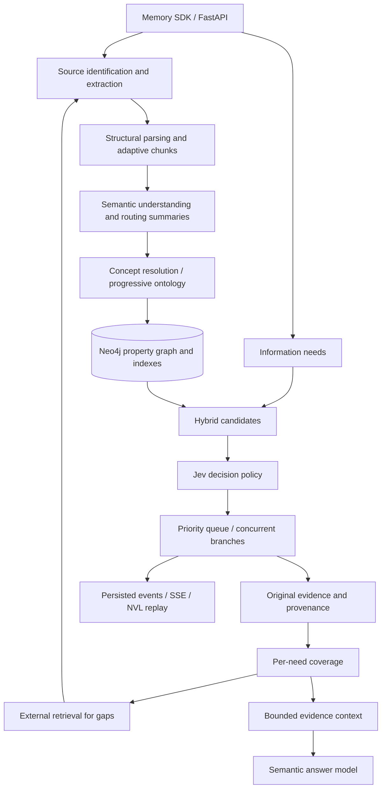

# Architecture

`Memory` is the application-facing SDK. FastAPI is a thin adapter over the same service used by the demo and integration tests. The application supplies settings, `GraphRepository`, `ModelProvider`, and optionally `ExternalRetriever`. Production uses Neo4j and OpenRouter; explicit demo mode uses an in-memory graph and deterministic mocks.

Files follow subsystem boundaries rather than one class per directory. `sources.py` owns source validation; `parsing.py` owns extraction coordination, tokenization and structure; `ontology.py` resolves concepts and aligns supplied ontologies; `ingestion.py` orchestrates atomic ingestion. `graph.py` owns storage and candidate search. `retrieval.py` owns supervisor/frontier state. `evidence.py` separates relevance, coverage, context and progressive enrichment. `llm.py` routes model operations; `prompts.py` centralizes prompts. `trace.py` and `service.py` persist execution state; `api.py` exposes it.

Neo4j is the only production persistence system. JSON payloads preserve nested Pydantic metadata while selected top-level properties support native indexes. Semantic graph nodes, edges, operational records and mutation locks have distinct labels. Fulltext and vector indexes seed candidates, graph adjacency constrains routes, aliases support concept reuse, and retrieval statistics remain separate from semantic claims.

One API process owns background query tasks; six graph workers by default run concurrently within each query. Timeouts, source limits, candidate limits, node/depth budgets, child limits and concurrent-query limits bound work. Queries and traces persist; restarted in-flight queries are marked failed rather than silently replaying paid inference. A distributed queue is intentionally absent from this MVP.
